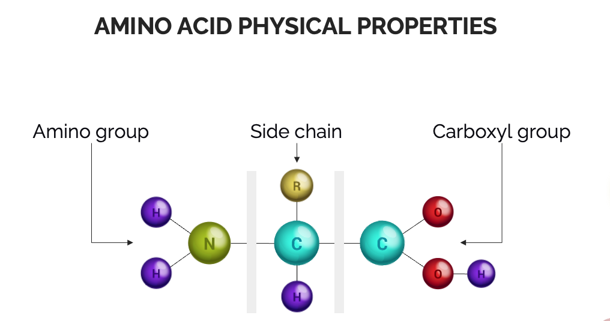

<h1
  id = "title";
  style="color:#4974a5; font-size:250%; text-align:left; border-bottom: 3px solid #4974a5;"
>
  A PROTEIN CLASSIFICATION PREDICTOR
</h1>

<h3
  id = "title";
  style="color:#207d06; font-size:220%; text-align:left; border-bottom: 3px solid #207d06;"
>
  Using Natural Language Processing (NLP) Machine Learning Methods on the Residue Sequences of Proteins.
</h3>

<h2
  id= "";
  style="color:#8fca6b; border-bottom: 1px solid #207d06;"
>
  Lighthouse Labs:
</h2>

  By Jamie Dormaar, February 16, 2023.

<!--
## THE PROJECT
-->

<h2
  id = "title";
  style="color:#207d06; f text-align:left; border-bottom: 2px solid #207d06;">
  THE PROJECT
</h2>

Mass Fingerprinting is a process by which protein identification is achieved by the analysis of the peptide and residue fragments from which its composed of. This remarkable and exciting technique promises to enrich widely ranging fields of research from Paleoproteomics to modern day health care and forensic analysis.

This was the inspiration for this project in which I imagined a nearly achievable rapid bio-classification system.

<!--
## METHODS
-->
<h2
  id = "title";
  style="color:#207d06; f text-align:left; border-bottom: 2px solid #207d06;">
  METHODS
</h2>

Since the biological monomeric sequences of nucleic acids and amino acids are each their own type of language, NLP techniques seem the most appropriate choice.

When deciding the real-world processes I had to account for, I considered forensic investigators, who'd have access to gas chromatography mass spectrometers:

- a full chemical hydrolysis would quantize the protein's amino acid frequencies, not too unlike a bag of words. - which I simulated with count vectorization

I also considered:

- protease cleavage, for example in research facilities - and simulated this by using n-grams with a single character over lap, and a vectorizer accounting for the sequential order of the peptides.

> ### FIGURE 1: Protein Composition Properties

  

<!--

-->

The physical and chemical attributes of the individual residues were accounted for proportionately by multiplication with each protein's count vectors, and averaged for the net value of that protein. Each protein's acidity, hydropathy index, and net charge were all accounted for this way.

<!--
## RESULTS
## RESULTS
-->
<h2 id = "RESULTS";
  style="color:#207d06; f text-align:left; border-bottom: 2px solid #207d06;">
  RESULTS
</h2>

> ### FIGURE 2: Prediction Accuracy results

  

I found another researchers work using a similar dataset and the same machine learning model, in the hope I could reproduce their results and from which to compare my work with. They were able to achieve a 55.42% prediction accuracy score using 32 classification labels. My model was able to improve on their work using 82 classification labels with a 66.45% prediction accuracy score.

> ### FIGURE 3: Confidence Matrix

  
  

As always with these things, there remains many adventurous opportunities for improvement.  The confidence matrix marked above for example, illustrates how the protein classification superfamilies under the labels numbered 54 and 65 are more frequently being miss-classified for the other than they are being classified appropriately.

<!--
## REFERENCES
## REFERENCES
-->
<h2 id = "REFERENCES";
  style="color:#207d06; f text-align:left; border-bottom: 2px solid #207d06;">
  REFERENCES
</h2>
